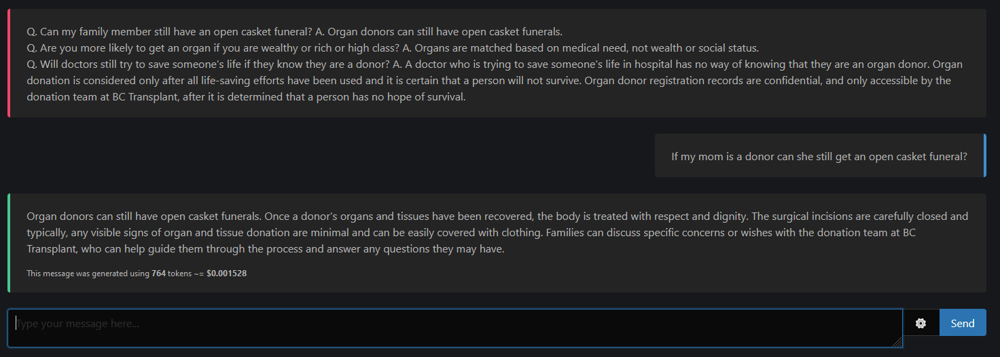

# ChatGPT-web

## **URL**: https://malyalar.github.io/tx-chatbot/



[](#contributors)

Transplant Chatbot is a patient education tool that is targeted towards providing, accurate, location-specific advice and counseling for prospective transplant donors or recipients. It is primed with information in advance by physicians and other providers. The chatbot uses the OpenAI ChatGPT API, and so to use it, you will need to register for [an OpenAI API key](https://platform.openai.com/account/api-keys). All messages are stored in your browser's local storage, but the data submitted to OpenAI's API can be stored and used in the future for other activities, such as training on the next iterations of GPT models. As a result, we would not recommend discussing confidential patient matters in this iteration of the chatbot. You can also close the browser tab and come back later to continue the conversation.

## Why?

Why not use the [official ChatGPT interface](https://chat.openai.com/)? Transplant Chatbot allows for responses that are more tailored to your domain and practice setting, while still using the reliable natural language processing of OpenAI's ChatGPT. Transplant Chatbot, which is a modified fork of https://github.com/Niek/chatgpt-web, is also itself open-source and extensible.

## Development

To run the development server, run

```bash
npm ci
npm run dev # or: npm run build
```

## Contributors

<!-- ALL-CONTRIBUTORS-LIST:START - Do not remove or modify this section -->
<!-- prettier-ignore-start -->
<!-- markdownlint-disable --> 
<table>
  <tbody>
    <tr>
      <td align="center" valign="top" width="14.28%"><a href="https://github.com/Niek"><br /><sub><b>abc91199</b></sub></a><br /><a href="#code-abc91199" title="Primary developer of ChatGPT-web">🤔</a></td>
      <td align="center" valign="top" width="14.28%"><a href="https://github.com/Michael-Tanzer"><br /><sub><b>Michael Tanzer</b></sub></a><br /><a href="#ideas-Michael-Tanzer" title="Ideas, Planning, & Feedback">🤔</a> <a href="https://github.com/Niek/chatgpt-web/commits?author=Michael-Tanzer" title="Code">💻</a></td>
      <td align="center" valign="top" width="14.28%"><a href="https://github.com/petergeneric"><br /><sub><b>Peter</b></sub></a><br /><a href="#ideas-petergeneric" title="Ideas, Planning, & Feedback">🤔</a></td>
      <td align="center" valign="top" width="14.28%"><a href="https://danb.me"><br /><sub><b>Dan Brown</b></sub></a><br /><a href="#ideas-ssddanbrown" title="Ideas, Planning, & Feedback">🤔</a></td>
      <td align="center" valign="top" width="14.28%"><a href="https://github.com/littlemoonstones"><br /><sub><b>littlemoonstones</b></sub></a><br /><a href="https://github.com/Niek/chatgpt-web/commits?author=littlemoonstones" title="Code">💻</a> <a href="#ideas-littlemoonstones" title="Ideas, Planning, & Feedback">🤔</a></td>
      <td align="center" valign="top" width="14.28%"><a href="https://github.com/maxrye1996"><br /><sub><b>maxrye1996</b></sub></a><br /><a href="https://github.com/Niek/chatgpt-web/issues?q=author%3Amaxrye1996" title="Bug reports">🐛</a></td>
      <td align="center" valign="top" width="14.28%"><a href="https://github.com/Mikemansour"><br /><sub><b>Mikemansour</b></sub></a><br /><a href="#ideas-Mikemansour" title="Ideas, Planning, & Feedback">🤔</a></td>
      <td align="center" valign="top" width="14.28%"><a href="https://github.com/abc91199"><br /><sub><b>abc91199</b></sub></a><br /><a href="#ideas-abc91199" title="Ideas, Planning, & Feedback">🤔</a></td>
      <td align="center" valign="top" width="14.28%"><a href="https://github.com/malyalar"><br /><sub><b>abc91199</b></sub></a><br /><a href="#code-abc91199" title="Ideas, code">🤔</a></td>
    </tr>
  </tbody>
</table>

<!-- markdownlint-restore -->
<!-- prettier-ignore-end -->

<!-- ALL-CONTRIBUTORS-LIST:END -->